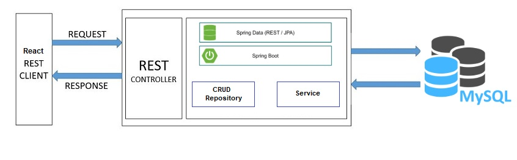

#  Freelancers' Marketplace using SpringBoot
Creating the prototype of Freelancer web application ( freelancer.com ) to demonstrate the use of stateless RESTful web services.


```
Individual assignment for CMPE 273 - Enterprise Distributed Systems.
```

## User stories:

* A user can Sign Up, Sign In and Logout from application.
* An authenticated user can Post Project and get bids from other users.
* An authenticated user can bid on projects posted.
* An authenticated user can Hire freelancer on the basis of bids received and can also change the freelancer for the project.
* An authenticated user can Check open projects and number of bids on projects posted by other users.
* An authenticated user can Check project completion date when freelancer is hired.
* An authenticated user can Create and edit profile information.

## System Design
> Applications uses a simple Client-Server architecture

* Client Side : ReactJS (HTML5 and Bootstrap)

* Server Side : Java, Springboot, Hibernate

* Database :  MySQL


## System Architecture


### Technology stack

<table>
<thead>
<tr>
<th>Area</th>
<th>Technology</th>
</tr>
</thead>
<tbody>
<tr>
<td>Front-End</td>
<td>React, Redux, React Router, Bootstrap, HTML5, CSS3, Javascript ( ES6 )</td>
</tr>
<tr>
<td>Back-End</td>
<td>Java, Springboot, Hibernate</td>
</tr>
<tr>
<td>API Testing</td>
<td>JUnit, Postman</td>
</tr>
<tr>
<td>Database</td>
<td>MySQL</td>
</tr>
<tr>
<td>Performance Testing</td>
<td>JMeter</td>
</tr>
<tr>
<td>NPM Modules</td>
<td>BCrypt, Multiparty, Axios</td>
</tr>
</tbody>
</table>
<br/>

### Steps to run application:

* Create database schema 
* Go to path : …\freelancer\
* npm install
* npm run start-dev 
> This will start ReactJS server on 3000 port and NodeJS server will start at 3001 port.

## 📝 Author

##### Jaykumar Patel <kbd> [Github](https://github.com/pateljay134) / [LinkedIn](https://www.linkedin.com/in/pateljay134) / [E-Mail](mailto:pateljay134@gmail.com)</kbd>

